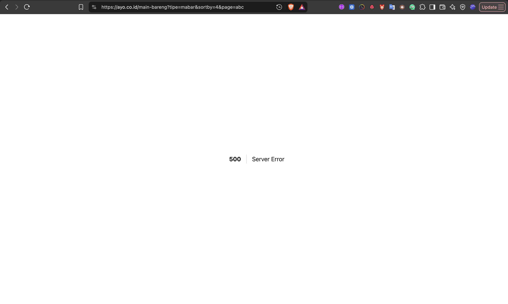
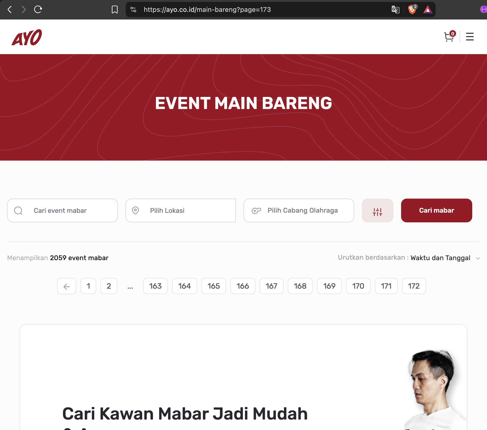
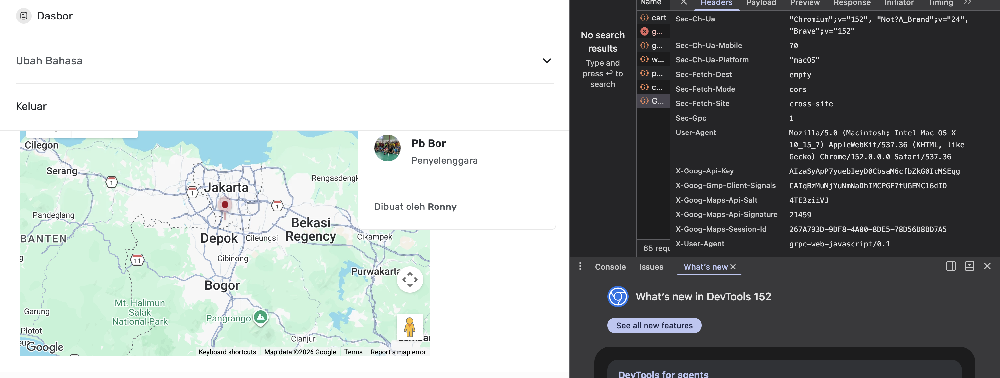

# JAWABAN SOAL NOMOR 2: Analisis Teknikal & Strategi Peningkatan Sistem AYO Indonesia

## 📋 Executive Summary
- Sistem saat ini sudah mengimplementasikan beberapa *best practice* keamanan dasar (seperti *Security Headers* dan *Content Security Policy*). 

- Namun, terdapat beberapa area krusial dari perspektif 
    - **Arsitektur Backend**,
    - **Keamanan API**, 
    - **Mobile User Experience** 

diperlukan optimasi lebih lanjut.

---

## 🔴 A. ANALISIS BACKEND & REST API (WEB)

### 1. Input Validation Bug — Parameter `page=abc` Menghasilkan HTTP 500
* **Temuan Pengujian (`cURL`):**
  ```bash
  curl -sI "https://ayo.co.id/main-bareng?tipe=mabar&sortby=4&page=abc"
  
  # Response: HTTP/2 500 Internal Server Error
  ```

  

- Tidak ada validasi di backend: Nilai mentah dari URL (page=abc) langsung ditelan mentah-mentah oleh controller.

- Kena hit ke DB: Nilai tersebut langsung ditembakkan ke database dalam bentuk query SQL (misal: OFFSET 'abc').

- Database menolak: Karena tipe datanya salah, query meledak (error), dan server akhirnya memuntahkan respon 500 Internal Server Error.


### SARAN
- Jika parameter kosong, bukan angka (page=abc), atau angka minus, otomatis fallback ke *default page = 1*. 

- Database tidak akan pernah menerima nilai invalid.

---

### 2. Tidak terpasang *Rate Limiting* pada Endpoint Publik
* **Temuan Pengujian (`cURL`):**
  ```bash
  for i in {1..5}; do
    curl -s -H "User-Agent: Mozilla/5.0" -w "Req $i: HTTP %{http_code} | TTFB: %{time_starttransfer}s\n" \
      "https://ayo.co.id/main-bareng?tipe=mabar&sortby=4" -o /dev/null
  done
  ```
  *Hasil:* Seluruh request berhasil diproses (`HTTP 200`) tanpa adanya header *throttling* (`X-RateLimit-*`, `Retry-After`, atau `429 Too Many Requests`).

  - Endpoint krusial seperti `/auth/login` rentan terhadap serangan **Brute Force** dan **Credential Stuffing**.

  - Endpoint pencarian & booking rentan terhadap *Bot Scalping* (script otomatis merebut kuota lapangan/event) dan *web scraping*.

### SARAN
  Implementasikan *Rate Limiter* di API Gateway atau HTTP Middleware (misalnya batas 10 req/menit per IP/User).

---

### 3. *Unbounded Pagination* (`page=99999999`)
* **Temuan Pengujian (`cURL`):**
  ```bash
  "https://ayo.co.id/main-bareng?tipe=mabar&sortby=4&page=99999999999999"
  ```

  

- Jika ada yang jahil mengirim request page=99999999 berulang kali, database akan sibuk membalik jutaan data. Akibatnya, user lain yang cuma buka page=1 ikut lambat atau terkena timeout.

- Koneksi ke database (connection pool) bakal tertahan lama menunggu query raksasa ini selesai, sampai akhirnya kuota koneksi habis.

### SARAN
- **Validasi Max Page Dinamis**: Hitung $\text{total\_page} = \lceil\text{total\_data} / \text{limit}\rceil$. Jika parameter page > total_page, sistem otomatis menetapkan page = 1.

- **Adopsi Keyset / Cursor Pagination**: Tinggalkan OFFSET dan gunakan pointer data terakhir (misal WHERE id > last_seen_id LIMIT 10) untuk memuat 10 item per request secara instan.
  
---

### 4. Eksposur API Key Google Maps
* **Temuan:**  
  Google Maps API Key (`AIzaSy...`) tercantum secara transparan di kode HTML frontend.

  

- Mengekspos API Key Google Maps di frontend adalah **standard industry practice (*by design*)** untuk Maps JavaScript SDK. 

- Mem-proxy rendering peta via backend server akan menimbulkan *latency* tinggi, pemborosan *bandwidth*, dan rusaknya fitur interaktif SDK.

### SARAN
- Pengamanan dilakukan di level GCP Console dengan mengaktifkan **HTTP Referrer Restrictions** (hanya domain `*.ayo.co.id` yang diizinkan) serta **API Scope Restrictions** (hanya Maps JavaScript API).

---