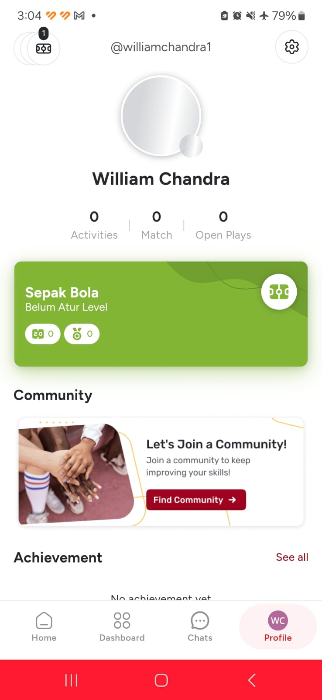
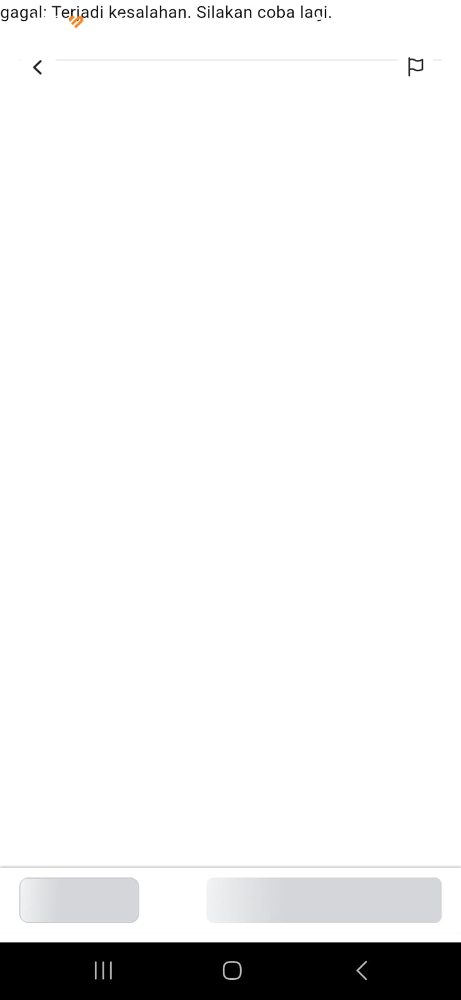

## 📱 B. ANALISIS & REKOMENDASI APLIKASI MOBILE (UX & ARSITEKTUR)

### 1. Penanganan Mode *Offline* & *State Indicator*
* **Temuan Pengujian:**  
  Saat aplikasi dikondisikan pada *Airplane Mode* atau tidak ada jaringan di layar Profil:

  
  

  - Data *cached* berhasil tampil ("0 Activities, 0 Match") tanpa crash (*poin positif*).
  - **Isu:** Tidak ada indikator visual (banner/toast) yang menginformasikan bahwa aplikasi sedang dalam kondisi *offline*.
  - Foto avatar pengguna terjebak pada status *skeleton loader* secara konstan.
* **Dampak UX:**  
  Pengguna akan berasumsi statistik mereka ter-reset menjadi 0 karena ketidakjelasan status koneksi.

### SARAN
  - Tampilkan floating banner: *"Anda sedang offline. Menampilkan data lokal terakhir."*